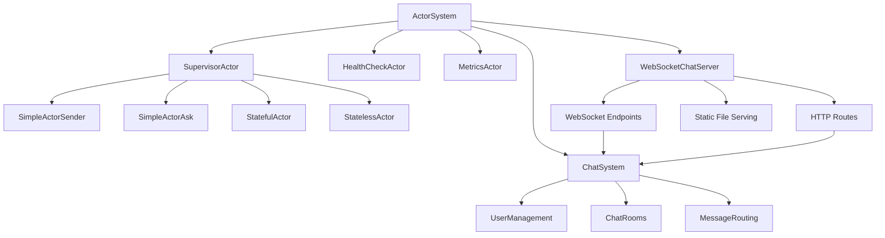

# 🎭 Akka Actor Model Demonstration

[](https://scala-lang.org)
[](https://openjdk.org/)
[](https://akka.io)

A comprehensive demonstration of **Actor Model** patterns using **Akka** with modern language features. This project showcases equivalent implementations in both **Scala 3** and **Java 21**, demonstrating how modern language features enable elegant actor-based programming.

## 🎯 Project Goals

This project demonstrates key concepts of the Actor Model through practical examples in both languages:

- **Actor Communication Patterns**: Fire-and-forget, request-response messaging
- **State Management**: Both mutable and immutable state handling in actors
- **Fault Tolerance**: Supervision strategies and error recovery
- **System Monitoring**: Health checks and metrics collection
- **Modern Language Features**: Sealed traits/classes, records, pattern matching
- **Cross-Language Comparison**: Equivalent implementations showcasing language paradigms
- **WebSocket Chat System**: Real-time multi-user chat with actor-based backend
- **HTTP/WebSocket Infrastructure**: Complete web server with bidirectional communication

## 🛠️ Technology Stack

### Scala Example

- **Scala 3.3.4**: Modern functional programming with sealed traits and case classes
- **Akka 2.6.21**: Actor framework for building concurrent applications
- **STTP 4.0.9**: HTTP client for external API integration
- **ScalaTest 3.2.19**: Testing framework with Akka TestKit

### Java Example

- **Java 21**: Modern OOP with sealed classes, records, and pattern matching
- **Akka 2.6.21**: Same actor framework, Java API
- **JUnit 5**: Modern testing framework
- **Maven**: Dependency management and build automation

## 🏗️ Architecture Overview

### Dual Implementation Structure

```
actor-model-with-akka/
├── scala-example/          # Scala 3 implementation
│   ├── src/main/scala/demo/
│   │   ├── actors/         # Actor implementations
│   │   ├── chat/          # Chat system with WebSocket support
│   │   ├── http/          # HTTP routes and WebSocket endpoints
│   │   │   ├── routes/    # WebSocket chat routes
│   │   │   └── models/    # WebSocket message models
│   │   └── messages/      # Message types (sealed traits)
│   └── build.sbt
├── java-example/           # Java 21 implementation
│   ├── src/main/java/demo/
│   │   ├── actors/        # Actor implementations
│   │   └── messages/      # Message types (sealed classes)
│   └── pom.xml
└── README.md
```

### Actor System Structure



## 🚀 Getting Started

### Scala Example

```bash
cd scala-example
sbt run
```

### Java Example

```bash
cd java-example
mvn clean compile exec:java
```

### WebSocket Chat System

The project includes WebSocket chat capabilities with different implementation levels:

#### Scala WebSocket Chat Server (Full Implementation)

The Scala example includes a complete WebSocket chat system with real-time multi-user support:

```bash
cd scala-example
sbt "runMain demo.WebSocketChatServer"
```

**Server Endpoints:**

- **Host**: `localhost:8080`
- **Chat Interface**: `http://localhost:8080/`
- **WebSocket Endpoint**: `ws://localhost:8080/chat/ws/{username}`
- **API Health Check**: `http://localhost:8080/api/health`
- **API Info**: `http://localhost:8080/api/info`

**Multi-User Testing:**

1. Open `http://localhost:8080` in multiple browser tabs
2. Set different usernames in each tab (e.g., Alice, Bob, Charlie)
3. Connect all users and join the same room (e.g., "general")
4. Start sending messages to test real-time communication

**Command Line Testing:**

```bash
# Run the WebSocket client simulation
sbt "runMain demo.WebSocketChatClient"

# Run the core actor chat demo
sbt "runMain demo.Main"
```

#### Java WebSocket Chat Server (Foundation)

The Java example provides HTTP server foundation with WebSocket infrastructure setup:

```bash
cd java-example
mvn clean compile exec:java -Dexec.mainClass="demo.WebSocketChatServer"
```

**Server Endpoints (Java):**

- **Host**: `localhost:8081` *(port 8081 to avoid conflict with Scala)*
- **Chat Interface**: `http://localhost:8081/`
- **API Health Check**: `http://localhost:8081/api/health`
- **API Info**: `http://localhost:8081/api/info`

**Java Implementation Features:**

- ☕ **Java 21** with modern language features
- 🎭 **Akka HTTP 10.2.10** server framework
- 🏗️ **Actor Model** foundation with Akka actors
- 📦 **Maven** build system
- 🔗 **HTTP endpoint** infrastructure ready for WebSocket expansion

**Language Comparison:**

- Compare `http://localhost:8080` (Scala) vs `http://localhost:8081` (Java)
- Both use the same Akka actor framework with language-specific implementations
- Scala version demonstrates full WebSocket chat functionality
- Java version shows foundational HTTP server setup for expansion

### Running Tests

**Scala:**

```bash
cd scala-example
sbt test
```

**Java:**

```bash
cd java-example
mvn test
```

## 📚 Actor Patterns Demonstrated

### 1. **Simple Actors** - Fire-and-Forget & Request-Response

**Scala Implementation:**

```scala
// Sealed trait for type safety
sealed trait Message
case class IntMessage(value: Int) extends Message
case class StringMessage(value: String) extends Message

class SimpleActorSender extends Actor with ActorLogging {
  def receive: Receive = {
    case IntMessage(value) => log.info(s"Processing: $value")
    case StringMessage(text) => log.info(s"Processing: $text")
  }
}
```

**Java Implementation:**

```java
// Sealed interface with records
public sealed interface Message
    permits IntMessage, StringMessage, DoubleMessage {
    String getContent();
}

public record IntMessage(int value) implements Message {
    @Override
    public String getContent() { return String.valueOf(value); }
}

public class SimpleActorSender extends AbstractActor {
    @Override
    public Receive createReceive() {
        return receiveBuilder()
            .match(IntMessage.class, this::handleIntMessage)
            .match(StringMessage.class, this::handleStringMessage)
            .build();
    }
}
```

### 2. **Stateful Actors** - State Management

Demonstrates mutable state management within actors:

- State transitions based on message types
- Thread-safe state modifications
- Worker status protocols

### 3. **Stateless Actors** - Behavior Switching

Uses `context.become` for behavior switching:

- Functional state management
- Dynamic behavior changes
- State machine implementation without explicit state variables

### 4. **Supervision Strategies** - Fault Tolerance

Implements fault tolerance patterns:

- **Resume**: Continue after minor failures
- **Restart**: Restart actor after recoverable failures
- **Stop**: Terminate actor after critical failures
- **Escalate**: Forward unknown failures to parent

### 5. **System Monitoring** - Health & Metrics

**HealthCheckActor**: Periodic system health monitoring

- Scheduled health checks every 30 seconds
- Actor registration and monitoring
- System health reporting

**MetricsActor**: Performance metrics collection

- Message counters and processing times
- Error tracking and reporting
- Automatic metrics reporting

### 6. **WebSocket Chat System** *(Scala Only)*

Complete real-time multi-user chat system with WebSocket support:

- **User Management**: Create and manage chat users with connection tracking
- **Room Management**: Create and join multiple chat rooms
- **Real-time Messaging**: WebSocket-based instant message delivery
- **Multi-User Support**: Concurrent users with real-time updates
- **Web Interface**: Complete HTML5/JavaScript client with modern UI
- **Actor-Based Backend**: Fault-tolerant message routing and state management

**Key Features:**

- **WebSocket Communication**: Bidirectional real-time messaging
- **Room Broadcasting**: Messages delivered to all room participants
- **User State Tracking**: Online/offline status and room memberships
- **Connection Management**: Graceful handling of connect/disconnect events
- **Message History**: Room message persistence and retrieval
- **Emoji Support**: Full Unicode and emoji message support

### 7. **WebSocket API & HTTP Endpoints** *(Scala Only)*

The system provides both WebSocket for real-time communication and HTTP endpoints for system monitoring:

#### WebSocket Chat Protocol

**Connection Endpoint:**

```
ws://localhost:8080/chat/ws/{username}
```

**Message Types:**

```json
// Join a chat room
{
  "type": "joinRoom",
  "roomName": "general"
}

// Send a message
{
  "type": "sendMessage",
  "roomName": "general",
  "content": "Hello everyone!"
}

// List available rooms
{
  "type": "listRooms"
}

// List online users
{
  "type": "listUsers"
}
```

**Response Types:**

```json
// Room joined successfully
{
  "type": "joinedRoom",
  "roomName": "general",
  "message": "Alice joined general"
}

// Message received
{
  "type": "messageReceived",
  "roomName": "general",
  "username": "Bob",
  "content": "Hello everyone!",
  "timestamp": 1625097600000
}

// Room list response
{
  "type": "roomList",
  "rooms": ["general", "project-alpha"]
}
```

#### HTTP Monitoring Endpoints

```http
GET /api/health          # System health check
GET /api/info           # Server information
GET /                   # WebSocket chat interface
```

## 🔬 Language Feature Comparison

### Message Type Definitions

**Scala 3:**

```scala
enum WorkerStatus {
  case Idle, Available, WaitingResponse, InMeeting
}

sealed trait StatefulMessage
case class AskForHelp(message: String) extends StatefulMessage
case class HelpResponse(message: String) extends StatefulMessage
```

**Java 21:**

```java
public enum WorkerStatusStateful {
    IDLE, AVAILABLE, WAITING_RESPONSE, IN_MEETING
}

public sealed interface StatefulMessage
    permits AskForHelpStateful, HelpResponseStateful;

public record AskForHelpStateful(String value) implements StatefulMessage {}
public record HelpResponseStateful(String value) implements StatefulMessage {}
```

### Pattern Matching

**Scala 3:**

```scala
def receive: Receive = {
  case AskForHelp(message) if status == Available =>
    status = WaitingResponse
    sender() ! HelpResponse("I will help you!")
  case _ => log.warning("Unexpected message")
}
```

**Java 21:**

```java
switch (status) {
    case IDLE, AVAILABLE -> {
        status = WorkerStatusStateful.WAITING_RESPONSE;
        getSender().tell(new HelpResponseStateful("I will help you!"), getSelf());
    }
    default -> log.error("Unexpected message in state {}", status);
}
```

## 🧪 Testing Strategies

### Scala Testing (ScalaTest + Akka TestKit)

```scala
class SimpleActorSpec extends TestKit(ActorSystem("test"))
    with AnyFlatSpecLike with ImplicitSender {

  "SimpleActor" should "respond to messages" in {
    val actor = system.actorOf(Props[SimpleActor])
    actor ! StringMessage("test")
    expectMsg(StringMessage("test"))
  }
}
```

### Java Testing (JUnit 5 + Akka TestKit)

```java
public class SimpleActorSenderTest {
    private static ActorSystem system;
    private static TestKit testKit;

    @Test
    void shouldProcessIntMessage() {
        TestKit probe = new TestKit(system);
        ActorRef actor = system.actorOf(Props.create(SimpleActorSender.class));

        actor.tell(new IntMessage(42), probe.getRef());
        probe.expectNoMessage(Duration.ofMillis(100));
    }
}
```

## ⚙️ Configuration

Both implementations share the same Akka configuration:

### Application Configuration (`application.conf`)

```hocon
akka {
  actor {
    provider = "akka.actor.LocalActorRefProvider"

    default-dispatcher {
      type = "Dispatcher"
      executor = "fork-join-executor"
      throughput = 5
    }
  }

  loggers = ["akka.event.slf4j.Slf4jLogger"]
  loglevel = "INFO"
}
```

## 🎨 Friendly Logging System

Both implementations feature a **beautiful, user-friendly logging system** with emojis, colors, and descriptive messages that make debugging and monitoring enjoyable.

### 🌟 Visual Features

- **🎭 Demo Actors**: Green colored with theater emoji for application logic
- **⚙️ Akka System**: Blue colored with gear emoji for framework messages
- **💬 Chat System**: Magenta colored with chat emoji for chat-related activities
- **🔥 Error Logs**: Highlighted error appender for critical issues

### 📝 Message Categories

- **🚀 Actor Lifecycle**: Launch emoji for actor startup/shutdown
- **🔢 Numeric Processing**: Number emoji for integer/decimal message handling
- **📝 Text Processing**: Document emoji for string message handling
- **💬 Communication**: Chat emoji for help requests and responses
- **🔄 State Transitions**: Arrow indicators showing status changes (e.g., `IDLE → WAITING_RESPONSE`)
- **✅ Success Operations**: Check mark for successful operations
- **❌ Error Conditions**: Cross mark for error states
- **⚠️ Warnings**: Warning emoji for unexpected situations
- **📊 Metrics**: Chart emoji for performance tracking

### 🎯 Example Log Output

**Actor Lifecycle:**

```
🎭 17:33:02 INFO  [SimpleActorSender] - 🚀 Actor 'simpleSender' started and ready to process messages
🎭 17:33:02 INFO  [StatefulActor] - 🏗️ Stateful worker 'Worker1' initialized with status: AVAILABLE
```

**Message Processing:**

```
🎭 17:33:02 INFO  [SimpleActorSender] - 🔢 Received integer value: 42 - Processing completed
🎭 17:33:02 INFO  [SimpleActorSender] - 📝 Received text message: 'Hello Akka!' - Processing completed
```

**State Management:**

```
🎭 17:33:06 INFO  [StatefulActor] - 💬 Help request received: 'Need help with Java Akka!'
🎭 17:33:06 INFO  [StatefulActor] - 🔄 Status transition: AVAILABLE → WAITING_RESPONSE
🎭 17:33:06 INFO  [StatefulActor] - ✅ Responding with offer to help
```

**System Messages:**

```
⚙️  17:33:19 INFO  [AKKA] - Running CoordinatedShutdown with reason [ActorSystemTerminateReason]
```

### 📋 Logging Configuration

Both projects use **Logback** with custom appenders for different log categories:

**Console Output:**

- Colored, emoji-rich console logging for development
- Separate appenders for demo actors, chat system, and Akka system
- Suppressed verbose framework logs for cleaner output

**File Output:**

- Detailed file logging for production debugging
- Separate files for different log levels and components
- Rolling log files with retention policies

**Configuration Example:**

```xml
<!-- Demo actors appender with custom formatting -->
<appender name="DEMO_CONSOLE" class="ch.qos.logback.core.ConsoleAppender">
    <encoder class="ch.qos.logback.core.encoder.LayoutWrappingEncoder">
        <layout class="ch.qos.logback.classic.PatternLayout">
            <pattern>🎭 %d{HH:mm:ss} %highlight(%-5level) %green([%logger{0}]) - %msg%n</pattern>
        </layout>
    </encoder>
</appender>
```

## 🏃‍♂️ Expected Output

### Java Example Output

```
🎯 Akka Actor Model Demo (Java 21 with Sealed Classes)
============================================================

📋 Running Complete Actor Pattern Demonstrations...

1️⃣ Simple Fire-and-Forget Pattern:
📨 Fire-and-Forget Pattern Demonstration
📨 Sent messages to SimpleActorSender (fire-and-forget pattern)
🎭 17:33:02 INFO  [SimpleActorSender] - 🚀 Actor 'simpleSender' started and ready to process messages
🎭 17:33:02 INFO  [SimpleActorSender] - 🔢 Received integer value: 42 - Processing completed
🎭 17:33:02 INFO  [SimpleActorSender] - 📝 Received text message: 'Hello Akka!' - Processing completed
🎭 17:33:02 INFO  [SimpleActorSender] - 🔢 Received decimal value: 3.14 - Processing completed

2️⃣ Request-Response Ask Pattern:
🔄 Request-Response Pattern (Ask) Demonstration
🎭 17:33:04 INFO  [SimpleActorAsk] - SimpleActorAsk 'simpleAsk' started
📩 Ask response: IntMessage[value=123]
📩 Ask response: StringMessage[value=Ask pattern works!]

3️⃣ Stateful Actor Pattern:
🔄 Stateful Worker Demonstration
🎭 17:33:06 INFO  [StatefulActor] - 🏗️ Stateful worker 'StatefulWorker1' initialized with status: AVAILABLE
🎭 17:33:06 INFO  [StatefulActor] - 💬 Help request received: 'Need help with Java Akka!'
🎭 17:33:06 INFO  [StatefulActor] - 🔄 Status transition: AVAILABLE → WAITING_RESPONSE
🎭 17:33:06 INFO  [StatefulActor] - ✅ Responding with offer to help

4️⃣ Stateless Actor with Behavior Switching:
🔄 Stateless Actor Behavior Switching Demonstration

5️⃣ Health Check System:
🏥 Health Check System Demonstration
🏥 Registered actors for health monitoring
🎭 17:33:12 INFO  [HealthCheckActor] - HealthCheckActor started

6️⃣ Metrics Collection:
📊 Metrics Collection Demonstration
📊 Recorded sample metrics
🎭 17:33:15 INFO  [MetricsActor] - MetricsActor started

7️⃣ Supervision Strategy:
👨‍💼 Supervision Strategy Demonstration
👨‍💼 Created child actor under supervision
🎭 17:33:17 INFO  [SupervisorActor] - SupervisorActor started

✅ All demonstrations completed successfully!
🎉 Java 21 Sealed Classes + Records equivalent to Scala sealed traits + case classes
💎 Complete Actor Model implementation with modern Java features
⚙️  17:33:19 INFO  [AKKA] - Running CoordinatedShutdown with reason [ActorSystemTerminateReason]
🎭 17:33:19 INFO  [SimpleActorSender] - 🛑 Actor 'simpleSender' stopped gracefully
```

### Scala Example Output

```
🎯 Akka Actor Model Demo (Scala 3)
========================================

📋 Running Actor Pattern Demonstrations...

1️⃣ Simple Actor Patterns:
🔄 Stateful Worker Demonstration
🎭 17:22:25 INFO  [SimpleActorSender] - 🚀 Actor 'simpleSender' started and ready to process messages
🎭 17:22:25 INFO  [SimpleActorSender] - 🔢 Received integer value: 42 - Processing completed
🎭 17:22:25 INFO  [SimpleActorSender] - 📝 Received text message: 'Hello Scala!' - Processing completed
🎭 17:22:25 INFO  [StatefulActor] - 🏗️ Stateful worker 'Gabriel' initialized with status: Idle

2️⃣ Chat System Demonstration:
🗣️  Chat System Demo Starting...
💬 17:22:25 INFO  [CHAT] - 👥 Creating Users...
💬 17:22:25 INFO  [CHAT] - ✅ User created: Alice (ID: user_123...)
💬 17:22:25 INFO  [CHAT] - ✅ User created: Bob (ID: user_124...)

💬 17:22:25 INFO  [CHAT] - 🏠 Creating Chat Rooms...
💬 17:22:25 INFO  [CHAT] - ✅ Room created: General (ID: room_123...)

💬 17:22:25 INFO  [CHAT] - 💬 Users joining rooms...
💬 17:22:25 INFO  [CHAT] - ✅ Alice joined General room
💬 17:22:25 INFO  [CHAT] - ✅ Bob joined General room

💬 17:22:25 INFO  [CHAT] - 📤 Sending messages...
💬 17:22:25 INFO  [CHAT] - 💬 Alice: Hello everyone!
💬 17:22:25 INFO  [CHAT] - 💬 Bob: Hi Alice! How are you?

3️⃣ Stateful Actor Communication:
🎭 17:22:25 INFO  [StatefulActor] - 💬 Help request received: 'Rafael, could you help me ?'
🎭 17:22:25 INFO  [StatefulActor] - 🔄 Status transition: Idle → WaitingResponse
🎭 17:22:25 INFO  [StatefulActor] - ✅ Responding with offer to help
🎭 17:22:25 INFO  [StatefulActor] - 🤝 Help response received: 'I will help you!'
🎭 17:22:25 INFO  [StatefulActor] - 🔄 Status transition: WaitingResponse → InMeeting

✅ All demonstrations completed successfully!
🎉 Scala 3 sealed traits + case classes with comprehensive actor patterns
💎 Complete Actor Model implementation with modern Scala features
⚙️  17:22:26 INFO  [AKKA] - Running CoordinatedShutdown with reason [ActorSystemTerminateReason]
🎭 17:22:26 INFO  [StatefulActor] - 🛑 Actor 'Gabriel' stopped gracefully
```

## 🔧 Development

### Adding New Actor Patterns

**Scala:**

1. Create new actor class in `scala-example/src/main/scala/demo/actors/`
2. Define message types using sealed traits and case classes
3. Add demonstration in `DemoExecutorHelper.scala`
4. Write tests using ScalaTest

**Java:**

1. Create new actor class in `java-example/src/main/java/demo/actors/`
2. Define message types using sealed interfaces and records
3. Add demonstration in `DemoExecutorHelper.java`
4. Write tests using JUnit 5

## 🎯 Learning Outcomes

After exploring both implementations, you will understand:

- **Actor Model Fundamentals**: Message passing, encapsulation, fault tolerance
- **Language Evolution**: How modern features enhance actor programming
- **Type Safety**: Sealed types for compile-time message verification
- **Pattern Matching**: Elegant message handling in both languages
- **Concurrency**: Safe concurrent programming without locks
- **System Design**: Building resilient, scalable actor systems
- **Testing**: Actor-specific testing strategies and tools

## 📄 Key Takeaways

This project demonstrates that modern language features in both Scala 3 and Java 21 enable:

- **Type-Safe Messaging**: Sealed types prevent runtime message errors
- **Elegant Pattern Matching**: Clean, readable message handling
- **Immutable Data**: Records and case classes for safe data structures
- **Functional Programming**: Both languages support functional paradigms
- **Industrial Strength**: Production-ready actor systems with monitoring

## 📄 License

This project is licensed under the MIT License - see the [LICENSE](LICENSE) file for details.
