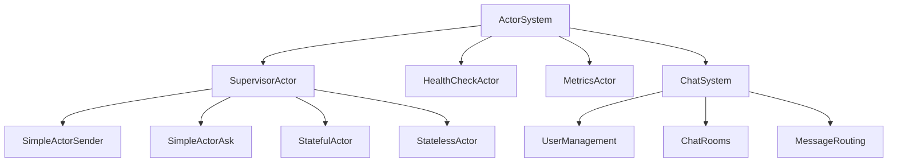

# 🎭 Akka Actor Model Demonstration

[](https://scala-lang.org)
[](https://openjdk.org/)
[](https://akka.io)

A comprehensive demonstration of **Actor Model** patterns using **Akka** with modern language features. This project showcases equivalent implementations in both **Scala 3** and **Java 21**, demonstrating how modern language features enable elegant actor-based programming.

## 🎯 Project Goals

This project demonstrates key concepts of the Actor Model through practical examples in both languages:

- **Actor Communication Patterns**: Fire-and-forget, request-response messaging
- **State Management**: Both mutable and immutable state handling in actors
- **Fault Tolerance**: Supervision strategies and error recovery
- **System Monitoring**: Health checks and metrics collection
- **Modern Language Features**: Sealed traits/classes, records, pattern matching
- **Cross-Language Comparison**: Equivalent implementations showcasing language paradigms

## 🛠️ Technology Stack

### Scala Example

- **Scala 3.3.4**: Modern functional programming with sealed traits and case classes
- **Akka 2.6.21**: Actor framework for building concurrent applications
- **STTP 4.0.9**: HTTP client for external API integration
- **ScalaTest 3.2.19**: Testing framework with Akka TestKit

### Java Example

- **Java 21**: Modern OOP with sealed classes, records, and pattern matching
- **Akka 2.6.21**: Same actor framework, Java API
- **JUnit 5**: Modern testing framework
- **Maven**: Dependency management and build automation

## 🏗️ Architecture Overview

### Dual Implementation Structure

```
actor-model-with-akka/
├── scala-example/          # Scala 3 implementation
│   ├── src/main/scala/demo/
│   │   ├── actors/         # Actor implementations
│   │   ├── chat/          # Chat system
│   │   └── messages/      # Message types (sealed traits)
│   └── build.sbt
├── java-example/           # Java 21 implementation
│   ├── src/main/java/demo/
│   │   ├── actors/        # Actor implementations
│   │   └── messages/      # Message types (sealed classes)
│   └── pom.xml
└── README.md
```

### Actor System Structure



## 🚀 Getting Started

### Scala Example

```bash
cd scala-example
sbt run
```

### Java Example

```bash
cd java-example
mvn clean compile exec:java
```

### HTTP Server (Scala Only)

The Scala example includes HTTP API infrastructure. To run the HTTP server:

```bash
cd scala-example
sbt "runMain demo.http.HttpServerApp"
```

**Server Details:**

- **Host**: `localhost:8080`
- **API Base**: `http://localhost:8080/api`
- **WebSocket**: `ws://localhost:8080/ws/chat/{userId}`

### Running Tests

**Scala:**

```bash
cd scala-example
sbt test
```

**Java:**

```bash
cd java-example
mvn test
```

## 📚 Actor Patterns Demonstrated

### 1. **Simple Actors** - Fire-and-Forget & Request-Response

**Scala Implementation:**

```scala
// Sealed trait for type safety
sealed trait Message
case class IntMessage(value: Int) extends Message
case class StringMessage(value: String) extends Message

class SimpleActorSender extends Actor with ActorLogging {
  def receive: Receive = {
    case IntMessage(value) => log.info(s"Processing: $value")
    case StringMessage(text) => log.info(s"Processing: $text")
  }
}
```

**Java Implementation:**

```java
// Sealed interface with records
public sealed interface Message
    permits IntMessage, StringMessage, DoubleMessage {
    String getContent();
}

public record IntMessage(int value) implements Message {
    @Override
    public String getContent() { return String.valueOf(value); }
}

public class SimpleActorSender extends AbstractActor {
    @Override
    public Receive createReceive() {
        return receiveBuilder()
            .match(IntMessage.class, this::handleIntMessage)
            .match(StringMessage.class, this::handleStringMessage)
            .build();
    }
}
```

### 2. **Stateful Actors** - State Management

Demonstrates mutable state management within actors:

- State transitions based on message types
- Thread-safe state modifications
- Worker status protocols

### 3. **Stateless Actors** - Behavior Switching

Uses `context.become` for behavior switching:

- Functional state management
- Dynamic behavior changes
- State machine implementation without explicit state variables

### 4. **Supervision Strategies** - Fault Tolerance

Implements fault tolerance patterns:

- **Resume**: Continue after minor failures
- **Restart**: Restart actor after recoverable failures
- **Stop**: Terminate actor after critical failures
- **Escalate**: Forward unknown failures to parent

### 5. **System Monitoring** - Health & Metrics

**HealthCheckActor**: Periodic system health monitoring

- Scheduled health checks every 30 seconds
- Actor registration and monitoring
- System health reporting

**MetricsActor**: Performance metrics collection

- Message counters and processing times
- Error tracking and reporting
- Automatic metrics reporting

### 6. **Chat System** *(Scala Only)*

Complete Slack-like chat implementation:

- **User Management**: Create and manage users
- **Room Management**: Create and join chat rooms
- **Real-time Messaging**: Broadcast messages to room participants

### 7. **HTTP API** *(Scala Only)*

RESTful API endpoints for chat system integration:

#### User Management Endpoints

```http
POST /api/users
Content-Type: application/json

{
  "username": "alice"
}
```

```http
GET /api/users
GET /api/users/{userId}
```

#### Room Management Endpoints

```http
POST /api/rooms
Content-Type: application/json

{
  "roomName": "Project Alpha"
}
```

```http
GET /api/rooms
GET /api/rooms/{roomId}
```

#### Room Operations

```http
POST /api/rooms/{roomId}/join
Content-Type: application/json

{
  "userId": "user_123"
}
```

```http
POST /api/rooms/{roomId}/leave
Content-Type: application/json

{
  "userId": "user_123"
}
```

#### Messaging Endpoints

```http
POST /api/rooms/{roomId}/messages
Content-Type: application/json

{
  "userId": "user_123",
  "content": "Hello everyone!"
}
```

```http
GET /api/rooms/{roomId}/messages?limit=50
```

#### WebSocket Connection

```http
GET /ws/chat/{userId}
Upgrade: websocket
```

## 🔬 Language Feature Comparison

### Message Type Definitions

**Scala 3:**

```scala
enum WorkerStatus {
  case Idle, Available, WaitingResponse, InMeeting
}

sealed trait StatefulMessage
case class AskForHelp(message: String) extends StatefulMessage
case class HelpResponse(message: String) extends StatefulMessage
```

**Java 21:**

```java
public enum WorkerStatusStateful {
    IDLE, AVAILABLE, WAITING_RESPONSE, IN_MEETING
}

public sealed interface StatefulMessage
    permits AskForHelpStateful, HelpResponseStateful;

public record AskForHelpStateful(String value) implements StatefulMessage {}
public record HelpResponseStateful(String value) implements StatefulMessage {}
```

### Pattern Matching

**Scala 3:**

```scala
def receive: Receive = {
  case AskForHelp(message) if status == Available =>
    status = WaitingResponse
    sender() ! HelpResponse("I will help you!")
  case _ => log.warning("Unexpected message")
}
```

**Java 21:**

```java
switch (status) {
    case IDLE, AVAILABLE -> {
        status = WorkerStatusStateful.WAITING_RESPONSE;
        getSender().tell(new HelpResponseStateful("I will help you!"), getSelf());
    }
    default -> log.error("Unexpected message in state {}", status);
}
```

## 🧪 Testing Strategies

### Scala Testing (ScalaTest + Akka TestKit)

```scala
class SimpleActorSpec extends TestKit(ActorSystem("test"))
    with AnyFlatSpecLike with ImplicitSender {

  "SimpleActor" should "respond to messages" in {
    val actor = system.actorOf(Props[SimpleActor])
    actor ! StringMessage("test")
    expectMsg(StringMessage("test"))
  }
}
```

### Java Testing (JUnit 5 + Akka TestKit)

```java
public class SimpleActorSenderTest {
    private static ActorSystem system;
    private static TestKit testKit;

    @Test
    void shouldProcessIntMessage() {
        TestKit probe = new TestKit(system);
        ActorRef actor = system.actorOf(Props.create(SimpleActorSender.class));

        actor.tell(new IntMessage(42), probe.getRef());
        probe.expectNoMessage(Duration.ofMillis(100));
    }
}
```

## ⚙️ Configuration

Both implementations share the same Akka configuration:

### Application Configuration (`application.conf`)

```hocon
akka {
  actor {
    provider = "akka.actor.LocalActorRefProvider"

    default-dispatcher {
      type = "Dispatcher"
      executor = "fork-join-executor"
      throughput = 5
    }
  }

  loggers = ["akka.event.slf4j.Slf4jLogger"]
  loglevel = "INFO"
}
```

## 🏃‍♂️ Expected Output

### Java Example Output

```
🎯 Akka Actor Model Demo (Java 21 with Sealed Classes)
============================================================

📋 Running Complete Actor Pattern Demonstrations...

🎯 Running Complete Actor Pattern Demonstrations
============================================================

1️⃣ Simple Fire-and-Forget Pattern:
📨 Fire-and-Forget Pattern Demonstration
📨 Sent messages to SimpleActorSender (fire-and-forget pattern)

2️⃣ Request-Response Ask Pattern:
🔄 Request-Response Pattern (Ask) Demonstration
📩 Ask response: IntMessage[value=123]
📩 Ask response: StringMessage[value=Ask pattern works!]

3️⃣ Stateful Actor Pattern:
🔄 Stateful Worker Demonstration

4️⃣ Stateless Actor with Behavior Switching:
🔄 Stateless Actor Behavior Switching Demonstration

5️⃣ Health Check System:
🏥 Health Check System Demonstration
🏥 Registered actors for health monitoring

6️⃣ Metrics Collection:
📊 Metrics Collection Demonstration
📊 Recorded sample metrics

7️⃣ Supervision Strategy:
👨‍💼 Supervision Strategy Demonstration
👨‍💼 Created child actor under supervision

✅ All demonstrations completed successfully!
🎉 Java 21 Sealed Classes + Records equivalent to Scala sealed traits + case classes
💎 Complete Actor Model implementation with modern Java features
```

### Scala Example Output

```
🎯 Akka Actor Model Demo (Scala 3)
========================================

📋 Running Actor Pattern Demonstrations...

1️⃣ Simple Actor Patterns:
🔄 Stateful Worker Demonstration
📨 Processing message: IntMessage(42)
📊 Current state: 42

2️⃣ Chat System Demonstration:
🗣️  Chat System Demo Starting...

👥 Creating Users...
✅ User created: Alice (ID: user_123...)
✅ User created: Bob (ID: user_124...)

🏠 Creating Chat Rooms...
✅ Room created: General (ID: room_123...)

💬 Users joining rooms...
✅ Alice joined General room
✅ Bob joined General room

📤 Sending messages...
💬 Alice: Hello everyone!
💬 Bob: Hi Alice! How are you?

✅ All demonstrations completed successfully!
🎉 Scala 3 sealed traits + case classes with comprehensive actor patterns
💎 Complete Actor Model implementation with modern Scala features
```

## 🔧 Development

### Adding New Actor Patterns

**Scala:**

1. Create new actor class in `scala-example/src/main/scala/demo/actors/`
2. Define message types using sealed traits and case classes
3. Add demonstration in `DemoExecutorHelper.scala`
4. Write tests using ScalaTest

**Java:**

1. Create new actor class in `java-example/src/main/java/demo/actors/`
2. Define message types using sealed interfaces and records
3. Add demonstration in `DemoExecutorHelper.java`
4. Write tests using JUnit 5

## 🎯 Learning Outcomes

After exploring both implementations, you will understand:

- **Actor Model Fundamentals**: Message passing, encapsulation, fault tolerance
- **Language Evolution**: How modern features enhance actor programming
- **Type Safety**: Sealed types for compile-time message verification
- **Pattern Matching**: Elegant message handling in both languages
- **Concurrency**: Safe concurrent programming without locks
- **System Design**: Building resilient, scalable actor systems
- **Testing**: Actor-specific testing strategies and tools

## 📄 Key Takeaways

This project demonstrates that modern language features in both Scala 3 and Java 21 enable:

- **Type-Safe Messaging**: Sealed types prevent runtime message errors
- **Elegant Pattern Matching**: Clean, readable message handling
- **Immutable Data**: Records and case classes for safe data structures
- **Functional Programming**: Both languages support functional paradigms
- **Industrial Strength**: Production-ready actor systems with monitoring

## 📄 License

This project is licensed under the MIT License - see the [LICENSE](LICENSE) file for details.
